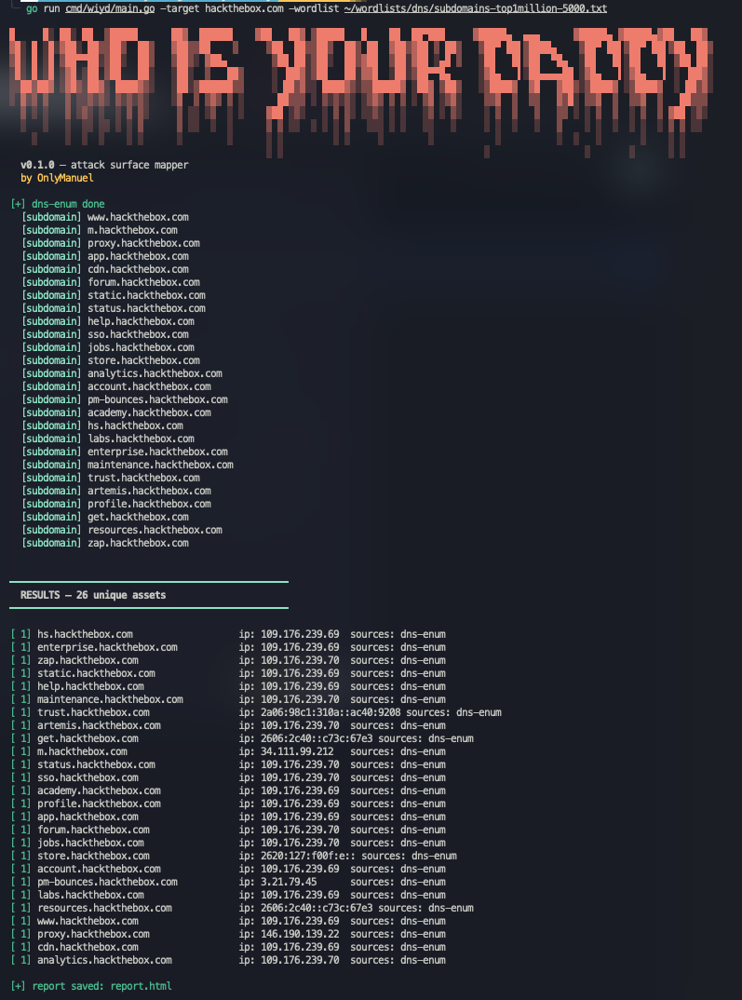
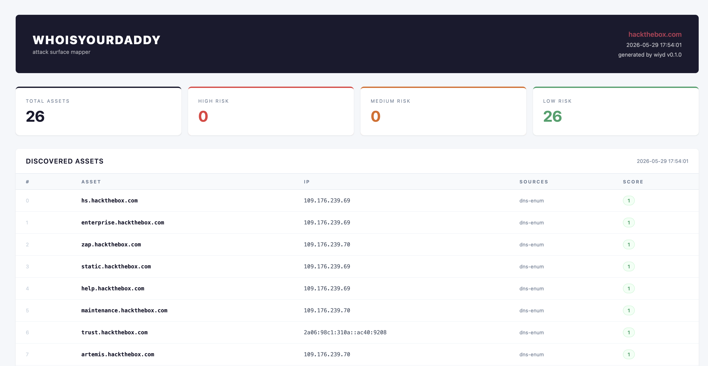

<div align="center">
  
  
  <br>
  
  **Attack Surface Mapper — Passive Reconnaissance Tool**
  
  <br>

  [](https://golang.org)
  [](LICENSE)
  []()
  []()
  []()

</div>

---

## Overview

**WhoIsYourDaddy** (`wiyd`) is a passive attack surface mapper written in Go. It aggregates data from multiple public sources to enumerate subdomains, resolve IP addresses, and generate a risk-scored asset inventory of a target domain — without sending a single packet to the target.

Designed for professional penetration testers and red teamers during the pre-engagement reconnaissance phase.

```
[+] crt.sh done
  [subdomain] gitlab.example.com
  [subdomain] admin.example.com
  [subdomain] vpn.example.com

[+] dns-enum done
  [subdomain] www.example.com
  [subdomain] mail.example.com

━━━━━━━━━━━━━━━━━━━━━━━━━━━━━━━━━━━━━━━━━━━━━━━━━━
  RESULTS — 5 unique assets

[ 5] gitlab.example.com       ip: 1.2.3.4       sources: crt.sh,dns-enum
[ 4] admin.example.com        ip: 1.2.3.5       sources: dns-enum
[ 4] vpn.example.com          ip: n/a            sources: crt.sh
[ 1] www.example.com          ip: 1.2.3.6       sources: dns-enum
[ 0] mail.example.com         ip: n/a            sources: crt.sh

[+] report saved: report.html
```


---

## Screenshots

<div align="center">
  
  <br><br>
  
</div>

---

## Features

- **Certificate Transparency** — queries crt.sh to extract subdomains from public SSL/TLS certificates
- **DNS Enumeration** — concurrent bruteforce with built-in wordlist or external SecLists-compatible file
- **Correlator** — deduplicates assets across sources and assigns risk scores based on naming patterns and exposure
- **HTML Report** — generates a professional, client-ready report with risk classification
- **Risk Scoring** — automatic prioritization of interesting assets (admin panels, VPNs, dev environments, APIs)
- **Zero target contact** — all recon is passive; no packets are sent to the target

---

## Installation

### Requirements

- Go 1.21 or higher

### From source

```bash
git clone https://github.com/0nlyManu/whoisyourdaddy.git
cd whoisyourdaddy
go build -o wiyd ./cmd/wiyd
```

### go install

```bash
go install github.com/0nlyManu/whoisyourdaddy/cmd/wiyd@latest
```

---

## Usage

```
USAGE
  wiyd -target <domain>
  wiyd -target <domain> -wordlist <wordlist>

OPTIONS
  -target      target domain to enumerate
  -wordlist    path to external wordlist file (optional)
  -output      output report file path (default: report.html)
  -h           show this help menu

EXAMPLES
  wiyd -target example.com
  wiyd -target example.com -wordlist /path/to/SecLists/Discovery/DNS/subdomains-top1million-5000.txt
  wiyd -target example.com -output /tmp/report.html
```

---

## Modules

| Module     | Type         | Description                                            |
| ---------- | ------------ | ------------------------------------------------------ |
| `crt.sh`   | Passive      | Extracts subdomains from Certificate Transparency logs |
| `dns-enum` | Semi-passive | DNS bruteforce with concurrent goroutine pool          |

**Coming soon**
- WHOIS / RDAP
- Shodan integration
- GitHub secrets scan
- Cloud asset discovery

---

## Risk Scoring

Assets are automatically scored from 0 to 10 based on:

| Criteria                                                                     | Points |
| ---------------------------------------------------------------------------- | ------ |
| Name contains: `admin`, `vpn`, `gitlab`, `internal`, `dev`, `staging`, `api` | +3     |
| Found by multiple sources                                                    | +2     |
| IP address resolved                                                          | +1     |

| Score | Risk Level |
| ----- | ---------- |
| 7–10  | 🔴 High     |
| 4–6   | 🟠 Medium   |
| 0–3   | 🟢 Low      |

---

## Report

WhoIsYourDaddy generates a professional HTML report suitable for client delivery.

The report includes:
- Scan metadata (target, date, tool version)
- Risk summary cards (total, high, medium, low)
- Full asset table with IP, sources, and risk score

---

## Project Structure

```
whoisyourdaddy/
├── cmd/wiyd/           entry point
├── sources/            data sources (crt.sh, dns-enum)
├── internal/
│   ├── correlator/     deduplication and risk scoring
│   ├── models/         shared data structures
│   ├── reporter/       HTML report generation
│   └── ui/             terminal output and colors
└── go.mod
```

---

## Legal Disclaimer

> **WhoIsYourDaddy is intended for authorized security testing and research purposes only.**
>
> Use of this tool against systems without prior written authorization from the system owner is illegal and may violate computer crime laws including but not limited to the Computer Fraud and Abuse Act (CFAA), the Italian Penal Code art. 615-ter, and equivalent legislation in other jurisdictions.
>
> The author assumes no liability and is not responsible for any misuse or damage caused by this tool. By using WhoIsYourDaddy, you agree that:
>
> - You have explicit written authorization to test the target system
> - You will use this tool only within the scope defined by your rules of engagement
> - You will comply with all applicable local, national, and international laws
> - The author bears no responsibility for your actions
>
> **This tool performs passive reconnaissance only. No packets are sent directly to the target.**

---

## License

MIT License — see [LICENSE](LICENSE) for details.

---

<div align="center">
  <sub>Built with Go · For authorized security testing only · <a href="https://github.com/0nlyManu">0nlyManu</a></sub>
</div>